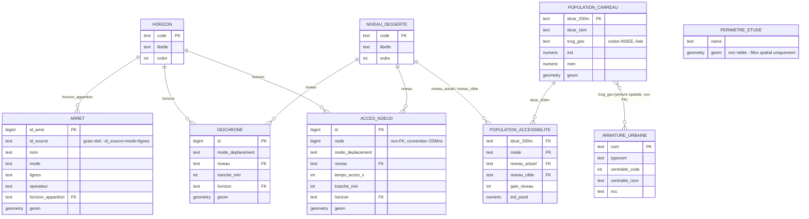

# Accessibilité MRN/SERM - MCD/MPD (sprint S2, mission P1)

Conception ab initio (aucune base existante). Source : neuf couches `.gpkg`
produites par le pipeline notebooks `00` à `06` (`perimetre_MRN`,
`reseau_pieton_MRN`, `reseau_velo_MRN`, `arrets_2026`, `arrets_SERM`,
`isochrones_2026`, `isochrones_SERM`, `acces_noeuds_2026`,
`acces_noeuds_SERM`, `population_carreaux_MRN`,
`population_accessibilite_MRN`) et `armature_urbaine.csv`. Fiabilité :
**proposé** partout - ce document conçoit un schéma, il n'en documente pas
un déjà écrit ; le niveau ne devient « confirmé » qu'après écriture du DDL
réel.

---

## 1. Deux points de modélisation actés dans ce sprint

### 1.1. Horizon : dimension plutôt que tables dupliquées

Le pipeline produit deux fichiers identiques en structure pour trois
couches (`arrets_*`, `isochrones_*`, `acces_noeuds_*`), qui ne diffèrent
que par la valeur de la colonne `horizon`. Une bascule naïve créerait six
tables quasi identiques ; le point de cadrage demande une dimension
horizon comme axe du modèle.

Deux logiques de dimension coexistent selon la nature de l'entité, et sont
traitées différemment plutôt qu'uniformément :

- **Donnée de référence (`ARRET`)** : un arrêt est un objet du monde réel
  qui existe ou non à une date donnée. Comparer les deux `head` fournis
  montre que les arrêts déjà en service (bus) sont répétés à l'identique
  (même `id_source`, même géométrie) dans `arrets_2026` et `arrets_SERM`.
  Dupliquer la ligne pour ce cas est une redondance accidentelle, pas une
  information. Modélisation retenue : un seul enregistrement par arrêt,
  avec un attribut `horizon_apparition` (première mise en service : `2026`
  ou `SERM`), et une vue métier `v_arrets_actifs(horizon)` qui reconstruit
  le réseau visible à un horizon donné (`horizon_apparition <= horizon`,
  ordre `2026 < SERM`).

  **Précision après vérification sur le jeu complet** : le grain réel de
  `ARRET` n'est pas *un point d'arrêt physique*, mais *un point × un mode
  × une ligne* - 17 points (préfixe `TCARxx`, opérateur `ATOUMOD001`,
  réseau de cars) portent le même `id_source` pour chaque ligne de car
  qui les dessert, `nom` et `operateur` restant identiques d'une ligne à
  l'autre mais `mode` et `lignes` variant. Le GeoPackage pré-joint donc
  l'arrêt à chaque service qui le dessert, plutôt que de livrer une table
  d'arrêts pure séparée d'une table de dessertes. Le principe
  `horizon_apparition` reste valide (c'est bien le service - point × mode
  × ligne - qui apparaît ou non à un horizon donné), mais `id_source` seul
  ne peut pas être la clé : la clé naturelle est `(id_source, mode,
  lignes)`.
- **Donnée calculée (`ISOCHRONE`, `ACCES_NOEUD`)** : ce sont des résultats
  d'un calcul de routage mené indépendamment pour chaque scénario réseau.
  Même quand la géométrie obtenue est identique entre les deux horizons
  (cas observé sur l'échantillon pour le niveau Bus), la ligne existe
  parce qu'un calcul a été rejoué, pas parce qu'un objet a été dupliqué.
  Modélisation retenue : `horizon` reste une colonne de la table de faits
  (clé étrangère vers une table `HORIZON`), sans tentative de dédoublonner
  les valeurs identiques - c'est le schéma classique dimension/fait.

`POPULATION_ACCESSIBILITE` est un troisième cas, traité à part en 3.6 :
l'horizon y est en colonnes (`niveau_actuel` / `niveau_cible`) et non en
lignes, par exception assumée.

### 1.2. Réseau viaire : hors base

**Décision actée dans ce sprint** (le cadrage d'origine listait ce point
comme non tranché) : le réseau viaire piéton/vélo reste hors base, en
fichiers `.graphml`/`.gpkg` consommés par OSMnx/NetworkX. Seules les
couches dérivées (`ACCES_NOEUD`, `ISOCHRONE`) sont migrées en PostGIS.

| Décision | Alternative écartée | Justification |
|---|---|---|
| Graphe viaire hors base (fichiers `.graphml`), seules les couches dérivées migrées | pgRouting (topologie et coûts en tables PostGIS, `pgr_dijkstra`) | Le graphe n'est consommé que par l'algorithmique OSMnx/NetworkX déjà en place ; aucun besoin de routage ad hoc en SQL n'est identifié dans le cadrage. pgRouting exigerait de reconstruire une topologie nodée et de reporter les colonnes `lanes`/`maxspeed`/`oneway` (typées en listes stringifiées dans les `.gpkg`, `['2','1']`) vers des coûts numériques - un travail de normalisation disproportionné pour un graphe jamais interrogé par jointure relationnelle en aval |

Conséquence sur le schéma : la colonne `ACCES_NOEUD.node` (identifiant de
nœud OSMnx, `bigint`) n'est **pas** une clé étrangère vers une table de
nœuds - c'est un lien conventionnel non contraint, documenté comme tel,
au même titre que `id_parcel` dans `dictionnaire_donnees_postgis.md`
(SeineCrops). Une évolution ultérieure vers pgRouting resterait possible
sans changer le grain des tables dérivées.

---

## 2. Modèle conceptuel de données



`PERIMETRE_ETUDE` (une seule ligne, périmètre Métropole + tampon) n'est
pas reliée aux autres entités : c'est un paramètre de découpage spatial du
pipeline (buffers +3 750 m arrêts / +5 000 m graphes viaires, cf. cadrage),
pas un objet métier. Elle est migrée à titre de traçabilité, sans relation
dans le MCD.

---

## 3. Modèle physique (DDL PostgreSQL/PostGIS)

Schéma unique `accessibilite` (pas de séparation `raw`/`derived` : les
`.gpkg` sources sont déjà le produit fini des notebooks `00`-`06`, aucune
ingestion de donnée brute n'est prévue en base pour ce projet - point de
périmètre distinct de SeineCrops). SRID 2154 (Lambert-93) partout, cf.
cadrage.

### 3.1. Tables de référence

```sql
CREATE SCHEMA IF NOT EXISTS accessibilite;

CREATE TABLE accessibilite.horizon (
    code    text PRIMARY KEY,          -- '2026' | 'SERM'
    libelle text NOT NULL,
    ordre   smallint NOT NULL UNIQUE   -- 1 = 2026, 2 = SERM
);

CREATE TABLE accessibilite.niveau_desserte (
    code  text PRIMARY KEY,             -- 'aucun','bus','TEOR','metro','car_express','train'
    libelle text NOT NULL,
    ordre smallint NOT NULL UNIQUE      -- porte l'ordre "aucun < bus < ... < train"
);
```

`niveau_ordre`, présent tel quel dans `isochrones_*.gpkg` et
`acces_noeuds_*.gpkg`, est aujourd'hui un entier répété à chaque ligne
sans garantie de cohérence entre couches. Le centraliser dans
`niveau_desserte.ordre` (contrainte `UNIQUE`) élimine ce risque - même
logique de normalisation que la dimension horizon.

### 3.2. Périmètre d'étude

```sql
CREATE TABLE accessibilite.perimetre_etude (
    id       serial PRIMARY KEY,
    name     text,
    display_name text,
    geom     geometry(Polygon, 2154) NOT NULL
);
```

### 3.3. Arrêts (dimension horizon = apparition)

**Vérifié sur le jeu complet** (`rapport_verification_gpkg.md`) : 0 arrêt
présent en 2026 et absent de SERM, 0 incohérence attribut/géométrie parmi
les 3 063 arrêts comparables communs aux deux horizons - le principe
`horizon_apparition` du §1.1 est confirmé.

**Différenciateur des `id_source` dupliqués identifié** : `mode` et
`lignes` varient (`nom` et `operateur` non), sur 17 `id_source` identiques
dans les deux fichiers - grain réel `(id_source, mode, lignes)`, pas
`id_source` seul (cf. §1.1). PK de substitution + `UNIQUE` sur la clé
naturelle :

```sql
CREATE TABLE accessibilite.arret (
    id_arret            bigserial PRIMARY KEY,
    id_source           text NOT NULL,
    nom                 text NOT NULL,
    mode                text NOT NULL,          -- 'Bus','TEOR','Metro','Car express','Train'
    lignes              text,
    operateur           text,
    horizon_apparition  text NOT NULL REFERENCES accessibilite.horizon(code),
    geom                geometry(Point, 2154) NOT NULL,
    UNIQUE (id_source, mode, lignes)
);

CREATE INDEX idx_arret_geom ON accessibilite.arret USING GIST (geom);
CREATE INDEX idx_arret_horizon ON accessibilite.arret (horizon_apparition);
CREATE INDEX idx_arret_id_source ON accessibilite.arret (id_source);
```

La contrainte `UNIQUE (id_source, mode, lignes)` reste à valider par le
chargement réel (la vérification a confirmé que `mode`/`lignes` sont les
seules colonnes différenciatrices parmi celles inspectées `nom`, `mode`,
`lignes`, `operateur` - pas encore qu'aucune autre combinaison ne se
répète au-delà de ces 17 cas).

Vue métier reconstruisant le réseau actif à un horizon donné :

```sql
CREATE VIEW accessibilite.v_arrets_actifs AS
SELECT a.*, h.ordre AS ordre_horizon
FROM accessibilite.arret a
JOIN accessibilite.horizon h ON h.code = a.horizon_apparition;
-- Consommateur : filtrer sur ordre_horizon <= (ordre de l'horizon demandé).
```

### 3.4. Isochrones (fait, dimension horizon = colonne)

```sql
CREATE TABLE accessibilite.isochrone (
    id                bigserial PRIMARY KEY,
    mode_deplacement  text NOT NULL,       -- 'piéton','vélo'
    niveau            text NOT NULL REFERENCES accessibilite.niveau_desserte(code),
    tranche_min       smallint NOT NULL,   -- 5, 10, 15
    horizon           text NOT NULL REFERENCES accessibilite.horizon(code),
    geom              geometry(MultiPolygon, 2154) NOT NULL,
    UNIQUE (mode_deplacement, niveau, tranche_min, horizon)
);

CREATE INDEX idx_isochrone_geom ON accessibilite.isochrone USING GIST (geom);
CREATE INDEX idx_isochrone_horizon_niveau ON accessibilite.isochrone (horizon, niveau);
```

**Vérifié sur le jeu complet** (`rapport_verification_gpkg.md`, 54
lignes cumulées 2026+SERM) : aucune combinaison répétée sur
`(mode_deplacement, niveau, tranche_min, horizon)` - la contrainte
`UNIQUE` ci-dessus est confirmée, pas seulement déduite du `head`.

### 3.5. Accès aux nœuds (fait, lien réseau non contraint)

```sql
CREATE TABLE accessibilite.acces_noeud (
    id                bigserial PRIMARY KEY,
    node              bigint NOT NULL,     -- identifiant nœud OSMnx - non-FK, cf. §1.2
    mode_deplacement  text NOT NULL,
    niveau            text NOT NULL REFERENCES accessibilite.niveau_desserte(code),
    temps_acces_s     integer NOT NULL,
    tranche_min       smallint NOT NULL,   -- discrétisation de temps_acces_s, dénormalisée
    horizon           text NOT NULL REFERENCES accessibilite.horizon(code),
    geom              geometry(Point, 2154) NOT NULL,
    UNIQUE (node, mode_deplacement, niveau, horizon)
);

CREATE INDEX idx_acces_noeud_geom ON accessibilite.acces_noeud USING GIST (geom);
CREATE INDEX idx_acces_noeud_node ON accessibilite.acces_noeud (node);
```

`tranche_min` duplique une information calculable depuis `temps_acces_s`
(même choix que `isochrone.tranche_min`) : conservée en colonne pour
partager la même clé de regroupement que `isochrone` sans recalcul côté
requête - à documenter comme redondance assumée dans le tableau de
décisions du projet, pas comme un oubli de normalisation.

**Vérifié sur le jeu complet** (`rapport_verification_gpkg.md`, 524 169
lignes cumulées 2026+SERM) : aucune combinaison répétée sur
`(node, mode_deplacement, niveau, horizon)` - la contrainte `UNIQUE`
ci-dessus est confirmée.

### 3.6. Population

**Vérifié sur le jeu complet** (`rapport_verification_gpkg.md`) : 36
colonnes, 5 915 lignes. Schéma nettement plus riche que celui déduit du
`head` - pyramide des âges en 10 tranches fines (`ind_0_3` à `ind_80p`,
pas la grille approximative `ind_25_39`/`ind_40_54`/etc. seule que
laissait supposer le `head`) et un bloc logement absent du `head`
(ancienneté du parc, statut d'occupation, collectif/individuel).

```sql
CREATE TABLE accessibilite.population_carreau (
    idcar_200m   text PRIMARY KEY,
    idcar_1km    text,
    idcar_nat    text,
    i_est_200    integer,     -- indicateur d'estimation Filosofi, grille 200 m
    i_est_1km    integer,     -- indicateur d'estimation Filosofi, grille 1 km
    lcog_geo     text,        -- codes INSEE séparés par virgule : carreau à cheval sur plusieurs communes
    ind          numeric,     -- population
    men          numeric,     -- ménages
    men_pauv     numeric,
    men_1ind     numeric,
    men_5ind     numeric,
    men_prop     numeric,     -- ménages propriétaires
    men_fmp      numeric,     -- ménages familles monoparentales
    ind_snv      numeric,     -- niveau de vie
    men_surf     numeric,     -- surface moyenne des logements
    men_coll     numeric,     -- logements collectifs
    men_mais     numeric,     -- logements individuels/maisons
    log_av45     numeric,     -- logements construits avant 1945
    log_45_70    numeric,
    log_70_90    numeric,
    log_ap90     numeric,
    log_inc      numeric,     -- ancienneté inconnue
    log_soc      numeric,     -- logements sociaux
    ind_0_3      numeric,
    ind_4_5      numeric,
    ind_6_10     numeric,
    ind_11_17    numeric,
    ind_18_24    numeric,
    ind_25_39    numeric,
    ind_40_54    numeric,
    ind_55_64    numeric,
    ind_65_79    numeric,
    ind_80p      numeric,
    ind_inc      numeric,     -- âge inconnu
    surf_origine numeric,
    frac         numeric,
    ind_pond     numeric,
    geom         geometry(MultiPolygon, 2154) NOT NULL
);

CREATE INDEX idx_population_carreau_geom ON accessibilite.population_carreau USING GIST (geom);
```

```sql
CREATE TABLE accessibilite.population_accessibilite (
    idcar_200m     text NOT NULL REFERENCES accessibilite.population_carreau(idcar_200m),
    mode           text NOT NULL,   -- 'piéton','vélo'
    niveau_actuel  text NOT NULL REFERENCES accessibilite.niveau_desserte(code),
    niveau_cible   text NOT NULL REFERENCES accessibilite.niveau_desserte(code),
    gain_niveau    smallint NOT NULL,
    ind_pond       numeric,
    PRIMARY KEY (idcar_200m, mode)
);
```

Exception assumée à la règle du §1.1 : ici l'horizon est en colonnes
(`niveau_actuel`/`niveau_cible`), pas en lignes. L'objet même de cette
table est la comparaison avant/après - la mettre sous forme dimension
horizon obligerait un auto-jointure pour recalculer `gain_niveau` à chaque
lecture, alors que le format large le porte nativement. Pas de colonne
géométrie : elle se déduit par jointure sur `population_carreau`, pour ne
pas dupliquer une géométrie déjà présente à la même granularité (contraste
volontaire avec le `.gpkg` source, qui la répète pour rester exportable
seul).

### 3.7. Armature urbaine (nouvelle source : `armature_urbaine.csv`)

```sql
CREATE TABLE accessibilite.armature_urbaine (
    com             text PRIMARY KEY,   -- code INSEE commune
    typecom         text,
    reg             text,
    dep             text,
    ctcd            text,
    arr             text,
    tncc            smallint,
    centralite_code smallint NOT NULL,
    centralite_nom  text NOT NULL,
    ncc             text,
    nccenr          text,
    libelle         text NOT NULL,
    can             text,
    comparent       text
);
```

71 communes, un rang de centralité par commune (`centralite_code` 1 à 7,
« Centralité métropolitaine » à « Centre-bourg »), donnée non
régénérable automatiquement (enrichissement manuel du COG, cf. cadrage).

Lien avec `population_carreau` : **pas de clé étrangère**.
`population_carreau.lcog_geo` contient parfois plusieurs codes INSEE
séparés par une virgule (`"27529,76231"`) - un carreau de 200 m peut
chevaucher deux communes. Une jointure attributaire sur ce champ donnerait
une correspondance approximative et fausserait toute agrégation par
commune. Recommandation pour la vue métier : jointure spatiale
(`ST_Intersects` + pondération par aire d'intersection), matérialisée si
besoin dans une table pont `carreau_commune(idcar_200m, com,
part_aire)` - hors périmètre du DDL de ce sprint, à instancier au sprint
de construction des vues métier.

---

## 4. Grain et volumétrie de référence

| Table | Grain | Volumétrie (confirmée le 25/08/2026, `rapport_verification_gpkg.md`) |
|---|---|---|
| `horizon` | un horizon | 2 lignes |
| `niveau_desserte` | un niveau de desserte | 6-7 lignes (aucun, bus, TEOR, métro, car express, train) |
| `perimetre_etude` | périmètre d'étude | 1 ligne |
| `arret` | un arrêt/quai physique - grain réel encore incertain, cf. §5 | 3 080 arrêts communs 2026/SERM + 28 nouveaux SERM ; `id_source` dupliqué 34× par fichier |
| `isochrone` | mode × niveau × tranche × horizon | 54 lignes (confirmé, unique) |
| `acces_noeud` | nœud × mode × niveau × horizon | 524 169 lignes (confirmé, unique) |
| `population_carreau` | un carreau INSEE 200 m | 5 915 lignes, 36 colonnes (confirmé) |
| `population_accessibilite` | carreau × mode | 2 × 5 915 = 11 830 lignes attendues |
| `armature_urbaine` | une commune | 71 lignes (confirmé, `armature_urbaine.csv`) |

---

## 5. À vérifier avant écriture du DDL réel

Tous les points ouverts de ce document sont désormais résolus par
`rapport_verification_gpkg.md` (25/08/2026) et son complément sur les
`id_source` dupliqués : unicité de `isochrone` et `acces_noeud` confirmée
sur le jeu complet, schéma complet de `population_carreaux_MRN` obtenu,
absence de suppression d'arrêt entre 2026 et SERM confirmée, grain réel de
`arret` identifié (`id_source, mode, lignes`).

Réserve résiduelle, de nature différente (validation, pas exploration) :
la contrainte `UNIQUE (id_source, mode, lignes)` sur `arret` n'a été
vérifiée que pour les 17 `id_source` dupliqués identifiés - à confirmer
par l'échec ou le succès du chargement réel plutôt que par une nouvelle
exploration ponctuelle, cf. `gabarit_dossier_projet.md` §9 (« jeu de
tests de schéma », les contraintes se vérifient à l'usage de la
migration, pas en amont indéfiniment).
